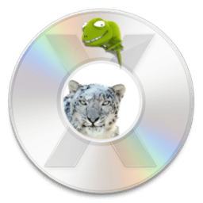

[](https://github.com/chris1111/Snow-Leopard-DVD-Creato/actions/workflows/pages/pages-build-deployment)

# Snow-Leopard-DVD-Creator 
* Also [USB Creator](https://github.com/chris1111/Snow-Leopard-DVD-Creator/blob/main/Usage-Snow-USB.md)

For Hackintosh PC and Laptop

<p></p>

#### This program will create a bootable ISO image of Snow Leopard 
The size of the DVD to use is 8.5GB.
## This package is used in two steps:
- Step 1: Create the 8.5GB DVD
- Step 2: Install Chameleon and the Network and Audio Drivers to the SSD were Snow Leopard is installed
### Everything is done manually using bash scripts.
- Read the script ➥ [Snow Leopard DVD Creator](https://github.com/chris1111/Snow-Leopard-DVD-Creator/blob/main/Snow%20DVD%20Creator) ➥ [Install Chameleon](https://github.com/chris1111/Snow-Leopard-DVD-Creator/blob/main/Install%20Chameleon)
- You can use this utility from Snow Leopard 10.6.7 up to macOS Tahoe 26 to create a DVD.
------------------------------------------------------------
### Usage: ⬇︎
- Git Clone

``` bash
git clone https://github.com/chris1111/Snow-Leopard-DVD-Creator.git
```
Or Download ➤ [Snow Leopard DVD Creator](https://github.com/chris1111/Snow-Leopard-DVD-Creator/archive/refs/heads/main.zip)
- Run from double clic on `Snow DVD Creator`

### 🎦 Video Usage ➤ [View Video](https://github.com/chris1111/Snow-Leopard-DVD-Creator/blob/main/Video-Usage.md)

### A simple Widget for the project ➤ [Chameleon Forever](https://github.com/chris1111/Snow-Leopard-DVD-Creator/blob/main/Widget-Usage.md)


------------------------------------------------------------
## Get Mac OS X Snow Leopard 10.6.7
#### Download  Mac OS X Snow Leopard 10.6.7 from Internet Archive ➦ [Mac OS X Snow Leopard 10.6.7](https://archive.org/details/mac-os-x-install-dvd_202606)

- You need a 8.5g DVD Double Layer

### Get ArticFox a compatible Browser for Snow ➤ [Arctic-Fox](https://github.com/rmottola/Arctic-Fox)

### No DVD Usage: USB Install Media ➤ [USB Mac OS X Snow Leopard](https://github.com/chris1111/Snow-Leopard-DVD-Creator/blob/main/Usage-Snow-USB.md)

Please read this NOTE:
---------------------
You can create an iso of Mac OS X Snow Leopard 10.6.7

If you have already create 
Mac OS X Install DVD.iso on the desktop, 
it will automatically deleted by the script. 

So If you would like to create more disk images; put the images 
in a folder apart before continue

------------------------------------------------------------
### Thanks to Chameleon team
### Package created by chris1111
- Chameleon - Enoch v2.4svn -rev 2923 ⟨Build Xcode  9.2 (9C40b) ( date 2026-05-04 11:25:01 )⟩
