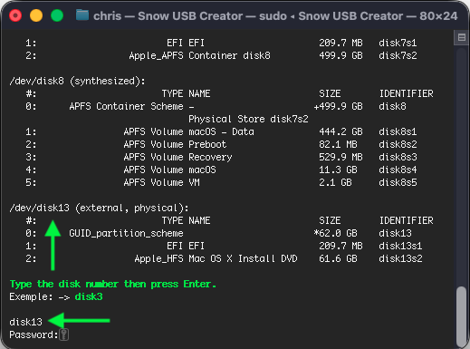

## Usage: USB Mac OS X Snow Leopard ⬇︎

#### USB Mac OS X Snow Leopard is an Utility for Bios (Legacy) Booting.

- This program will create a USB Media of Mac OS X Snow Leopard.
- He will also install Chameleon Bootloader.

#### You need (`Mac OS X Install DVD.dmg`) disk image of (`10.6.7`) 

#### Make sure you have a 16 Gig USB drive and that it is properly plugged in.

#### NOTE: USB ---> HFS+J , FAT32, EXFAT, NTFS are accepted!
APFS Drive not accepted!

#### To Proceed ⬇︎

### Download ➤ [USB Mac OS X Snow Leopard](https://github.com/chris1111/Snow-Leopard-DVD-Creator/releases/download/USB-V1/USB.Mac.OS.X.Snow.Leopard.zip)
- Unzip Archive
- Run from double clic on `Snow USB Creator`

#### Post Install: Run `Install Chameleon`

### A screenshot at the Chameleon installation stage to the USB ⬇︎

